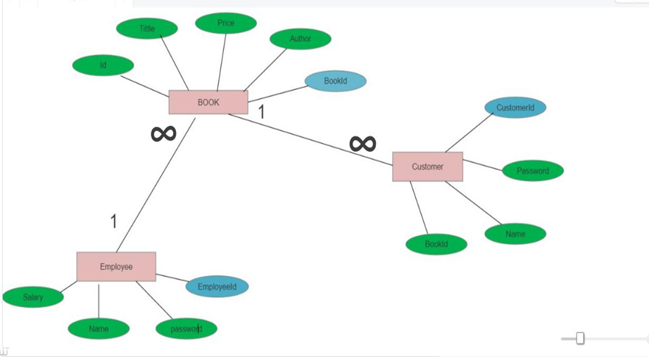
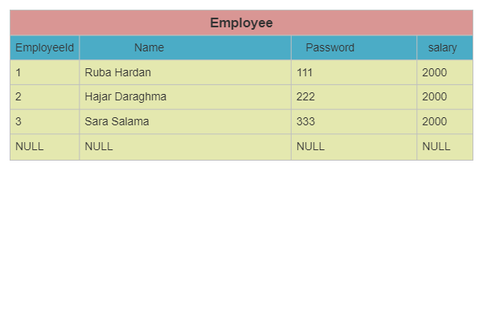
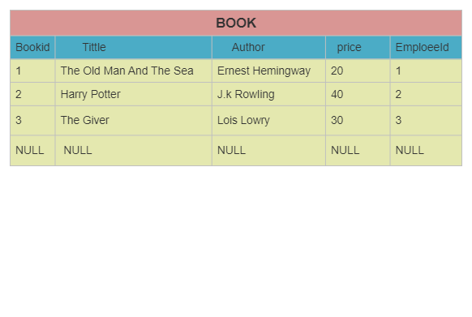
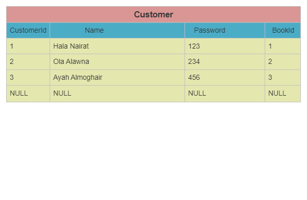
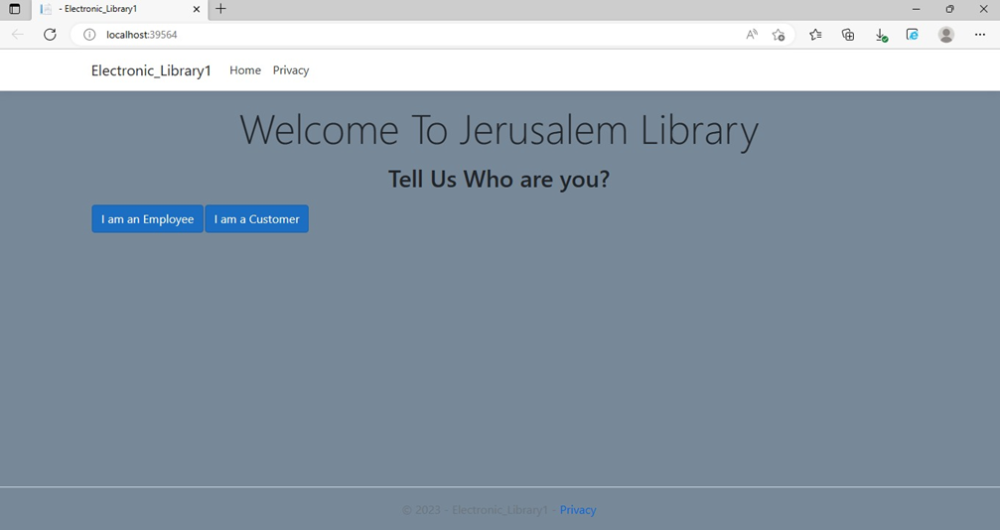
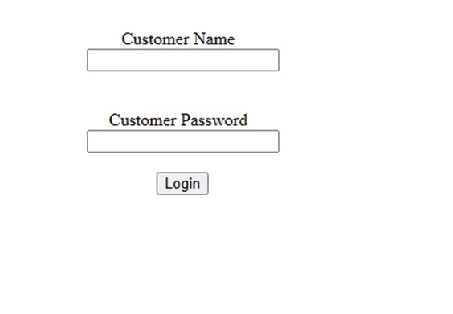
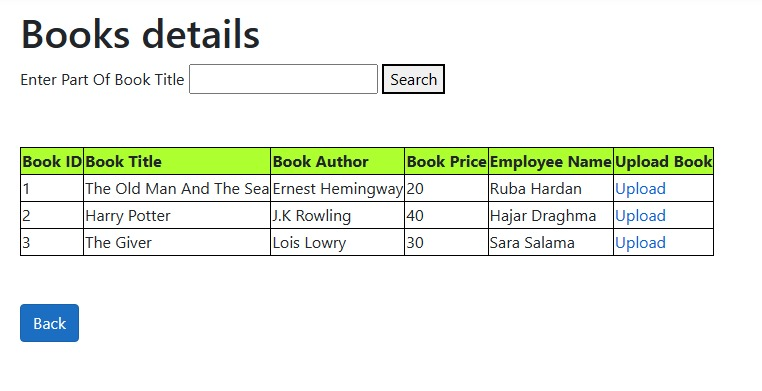
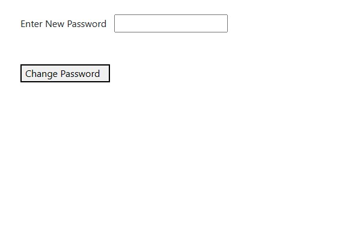
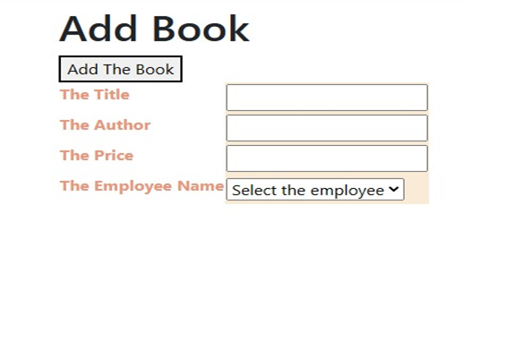

Functional Requirements
In general, my application is an electronic library, which can be used by two types of users, the employee and the customer, and each of
them has different powers, but users can log in and log out of the application, and the employee has the ability to add and delete a book 
and log out of the application, but the customer has The ability to upload a specific book and has the ability to change the password as well.

ER-Diagram

Relational Tables

Home Page

Log in Page

Welcome Page

Search Page

Upload Page

Change Password Page

Add Page

Delete Page

Logout Page

